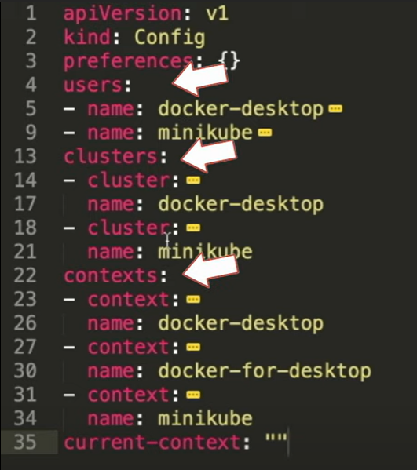
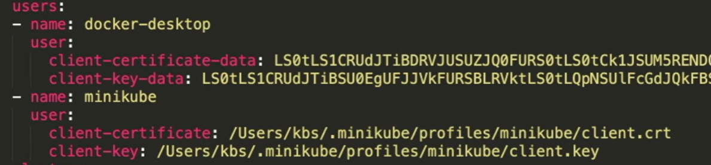
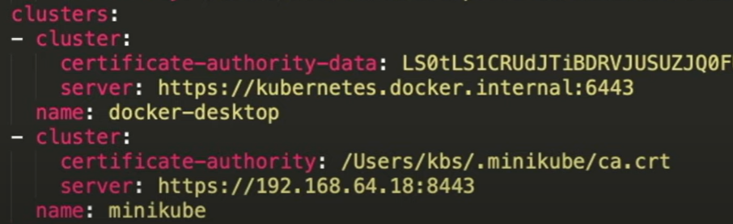
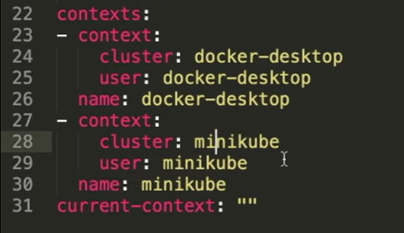
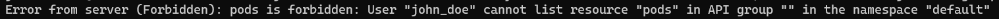

# Authentication

La autenticación consiste en comprobar la identidad de un usuario contra la información que tenemos en el sistema. En otras palabras, el sistema válida que el usuario que realiza la petición es quien dice ser.


## [Organización de acceso al cluster de kubernetes utilizando el archivo kubeconfig](https://kubernetes.io/docs/concepts/configuration/organize-cluster-access-kubeconfig/)

El archivo kubeconfig organiza la información acerca de clusters, usuarios, namespaces y mecanismos de autenticación. El cliente kubectl utiliza los archivos de kubeconfig para encontrar la informaciòn que necesita para elegir el cluster al que se desea conectar

Utilizando el comando ```kubectl config view``` podremos visualizar la información actual de nuestro kubeconfig.



En el kubeconfig podremos encontrar: *User*, *CLuster* y *Context*

- **User**
Lo más comun es configurarlo con certificados (Cerificado y key)



- **Cluster**
Autoridad Certificadora (ca) y el servidor



- **Context**
- 
Es la combinación entre usuarios y clusters



**Nota: La división de multiples contextos o inclusive multiples archivos de configuración es importate para saber hacia que cluster nos vamos a conectar y con que privilegios. Por ejemplo, no queremos llegar a implementar objetos de desarrollo en el ambiente de producción.**

--------------------------------------------------

## [Configurar acceso para un usuario](https://kubernetes.io/docs/reference/access-authn-authz/certificate-signing-requests/#normal-user)

### Certificate Signing Request (**CSR**)

- Crear un certificado para el usuario que llamaremos "john_doe"

```bash
openssl genrsa -out john_doe.key 2048
```

- Crearemos un archivo de configuración (.cnf). Donde el Common Name (**CN**) es el nombre del usuario y Organization (**O**) es el grupo al que el usuario pertenecerá.

```bash
cat << EOF > server_cert.cnf
[req]
distinguished_name = req_distinguished_name
prompt = no
[req_distinguished_name]
C = CO
O = devops
OU = devops
CN = john_doe
EOF
```
- Con openssl generaremos el CSR, apoyandonos del certificado creado anteriormente y el archivo de configuración

```bash
openssl req -new -key john_doe.key -out john_doe.csr -config server_cert.cnf
```

- Por otra parte, contamos con el manifiesto *certificatesigningrequest.yaml*, el cual define la creación del Certificate Signing Request en nuestro Kubernetes

```yml
# certificatesigningrequest.yaml
apiVersion: certificates.k8s.io/v1
kind: CertificateSigningRequest
metadata:
  name: john_doe
spec:
  signerName: kubernetes.io/kube-apiserver-client
  groups:
  - system:authenticated  
  request: BASE64ENCODE
  expirationSeconds: 86400  # (86400=one day) This line is optional, could be omitted
  usages:
  - client auth
```

- Con las siguientes lineas obtendremos el certificado creado anteriormente, lo convertiremos a base64 y le eliminaremos cualquier caracter de salto de linea. Después utilizando el commando *sed* reemplazaremos el valor obtenido en el manifest *certificatesigningrequest.yaml*

```bash
JOHN_DOE_CSR=$(cat john_doe.csr | base64 | tr -d "\n")
sed -i "s/BASE64ENCODE/${JOHN_DOE_CSR}/g" certificatesigningrequest.yaml
```

- Se aplicaran los cambios en nuestro cluster (Asegurese de estar trabajando en el contexto que tenga privilegios para utilizar esta acción adicionando *--context=minikube*)

```bash
kubectl apply -f certificatesigningrequest.yaml
```
- El Certificate Singing Request  ha sido enviado al cluster, lo siguiente será aprobarlo. Con el comando ```kubectl get csr``` podemos ver que el CSR esta en estado "Pending" a la espera de que el que administrado de kubernetes lo apruebe

- Esta aprobación la haremos manualmente

```
kubectl certificate approve john_doe
```

- Una vez aprobado, extraeremos el certificado firmado para almacenarlo en el archivo *john_doe.crt*

```
kubectl get csr john_doe -o jsonpath="{.status.certificate}" | base64 -d > john_doe.crt
```

Podremos ver que el certificado esta firmado por "kubernetes" (Autoridad firmante). Si no le definimos tiempo de expiración por defecto estará valido por un año

```
openssl x509 -in john_doe.crt -text
```

En resumen, john_doe ahora es un usuario normal que usa el certificado john_doe.crt and john_doe.key para autenticarse e invocar el API. Esto es poque el certificado ha sido firmado por el cluster de kubernetes.


------------------------------------

### Configurar certificado del usuario john_doe en Kubectl

- Vamos a echar un vistazo al kubeconfig 

```
kubectl config view
```

- Si intentaramos realizar una peticón al api obtendriamos un error

```
kubectl --context=john_doe get pods
```


- Añadiremos las nuevas credenciales

```
kubectl config set-credentials john_doe --client-key=john_doe.key --client-certificate=john_doe.crt --embed-certs=true
```

- Asociaremos usuario y cluster, con ello obtendremos el contexto

```
kubectl config set-context john_doe --cluster=minikube --user=john_doe
```

- Podremos visualizar los cambios en el kubeconfig

```
kubectl config view
```

- Ahora para validar la conexión intentemos realizar una petición al API

```
kubectl --context=john_doe get pods
```



----------------------------------------------------

# Authorization

La autorización especifica los derechos o privilegios de acceso a los recursos con los que cuenta el usuario

En kubernetes contamos con:

-  **Role**: Un Role declara los permisos que afectan a los namespaces, cuenta con:
   - Recursos: Pods, services, volumens, etc
   - Verbs: Acciones que se pueden hacer sobre los recursos (Get, List, etc)

- **Role Bindings**: Asocia a un grupo de usuarios con un rol

- **Cluster Role**: Permiso para acceder a todo el cluster  
  - Role
  - Subject (Usuario o grupo) ó el Service Account 

- **Cluster Role Binding**: Asocia a un grupo de usuarios con un cluster rol

- **Services account**: Este sirve para asignarle permisos a un pod o un set de pods

----------

- Para nuestro ejercicio crearemos un role *developer* con permisos

```
kubectl create role developer --verb=create --verb=get --verb=list --verb=update --verb=delete --resource=pods
```

- Veamos el manifiesto

```
kubectl get role developer -o yaml
```

**Nota: Fijensé que por defecto el namespace asignado es *default*, es así que los privilegios del role se limitan a solo ese namespace.**


- Por último asociaremos el rol *developer* creado al usuario *john_doe*

```
kubectl create rolebinding developer-binding-john_doe --role=developer --user=john_doe
```

- Ahora, sí podremos utilizar el usuario *john_doe* para consultar contra el api de kubernetes

```
kubectl --context=john_doe get pods
```

- Recuerde, como el role fue creado sobre el namespace default, si el usuario intentara acceder a los recursos de otro namespace como *kube-system* no tendría los privilegios de hacerlo

```
kubectl --context=john_doe get pods -ns kube-system
```
